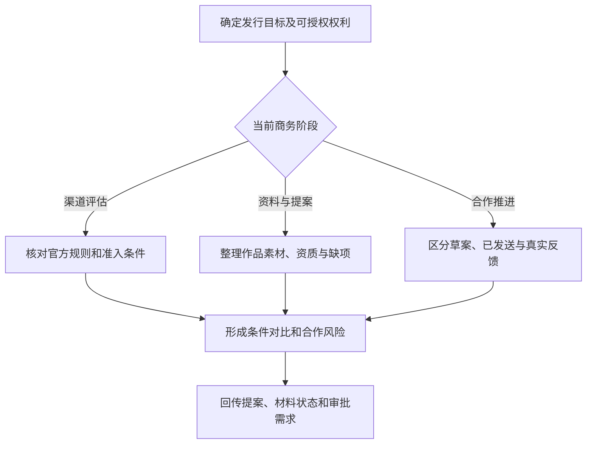

# 发行商务经理 · 个人工作方法

判断本次是渠道筛选、投稿准备、合作提案、谈判支持还是跟进记录，选择必要的渠道条款、作品信息、权利和授权证据。

```mermaid
flowchart TD
 A["确定发行目标及可授权权利"] --> B{"当前商务阶段"}
 B -->|渠道评估| C["核对官方规则和准入条件"]
 B -->|资料与提案| D["整理作品素材、资质与缺项"]
 B -->|合作推进| E["区分草案、已发送与真实反馈"]
 C --> F["形成条件对比和合作风险"]
 D --> F
 E --> F
 F --> G["回传提案、材料状态和审批需求"]
```

对独家、地域、期限、版权范围、结算及保底等关键条款进行风险提示。未知合作方信息和条款标记待核实，正式签署应获权利人批准并由适当专业人员复核。
