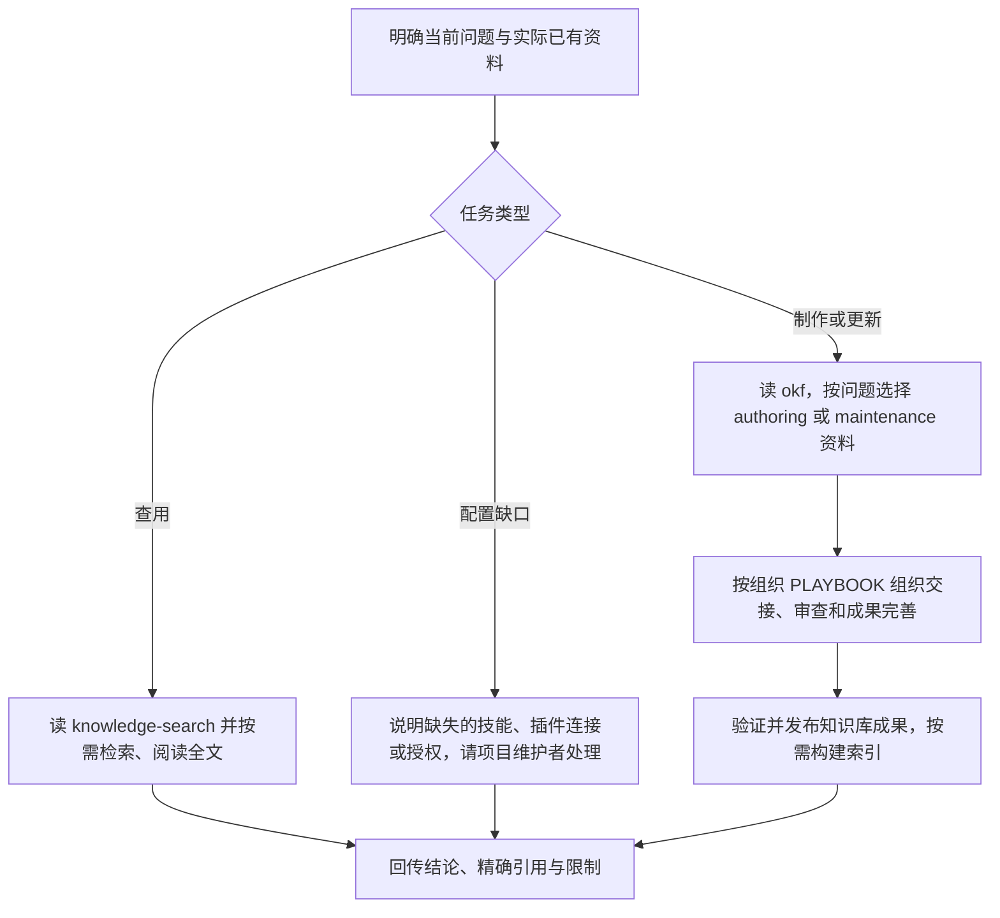

# 负责人工作方法

先确认问题属于已有知识使用、内容制作还是维护配置。查用已有知识选择 `knowledge-search`；制作与更新选择 `okf`，具体协作选择 `project-coordination`。按组织 PLAYBOOK 安排交接和独立审查，来源不足时缩小结论，避免用常识填补事实缺口。

```mermaid
flowchart TD
    A[明确当前问题与实际已有资料] --> B{任务类型}
    B -->|查用| C[读 knowledge-search 并按需检索、阅读全文]
    B -->|制作或更新| D[读 okf，按问题选择 authoring 或 maintenance 资料]
    B -->|配置缺口| E[说明缺失的技能、插件连接或授权，请项目维护者处理]
    D --> F[按组织 PLAYBOOK 组织交接、审查和成果完善]
    F --> G[验证并发布知识库成果，按需构建索引]
    C --> H[回传结论、精确引用与限制]
    E --> H
    G --> H
```
