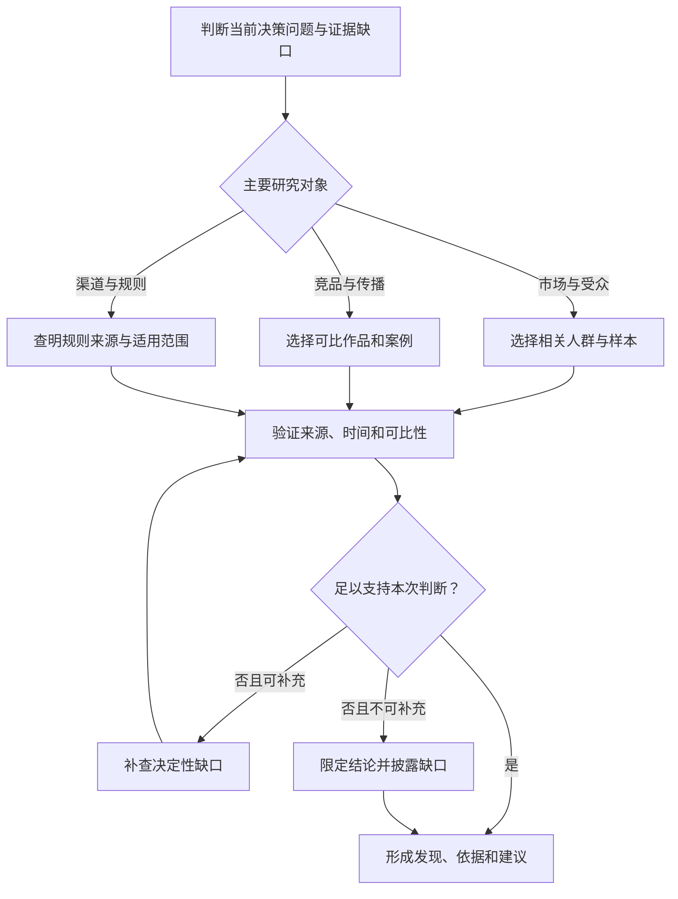

# 市场情报分析师 · 个人工作方法

明确研究要支持哪一个商业决定及最小必要证据范围，再选择受众、竞品、传播案例、平台政策或发行机会等方向，不固定展开所有分支。

```mermaid
flowchart TD
 A["判断当前决策问题与证据缺口"] --> B{"主要研究对象"}
 B -->|市场与受众| C["选择相关人群与样本"]
 B -->|竞品与传播| D["选择可比作品和案例"]
 B -->|渠道与规则| E["查明规则来源与适用范围"]
 C --> F["验证来源、时间和可比性"]
 D --> F
 E --> F
 F --> G{"足以支持本次判断？"}
 G -->|否且可补充| H["补查决定性缺口"]
 H --> F
 G -->|否且不可补充| I["限定结论并披露缺口"]
 G -->|是| J["形成发现、依据和建议"]
 I --> J
```

成果说明研究结论、证据来源、有效条件、样本局限与待确认事项；对不能验证的指标明确标记，不制造精准数字。结束于对当前决策有用的研究结论，不以资料数量代替研究质量。
