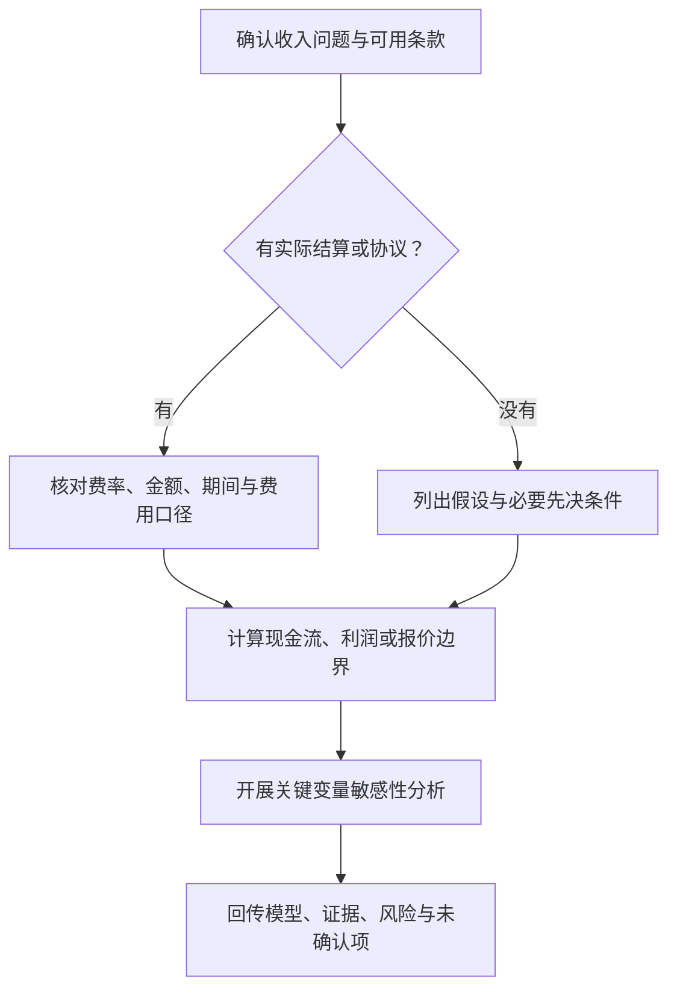

# 商业变现经理 · 个人工作方法

明确要回答的是收益模式选择、报价、项目利润、分账还是回款核对；将已有条款、成本、权利和结算周期分开检查。按任务复杂度选择简单计算或保守/基准/乐观情景。

```mermaid
flowchart TD
 A["确认收入问题与可用条款"] --> B{"有实际结算或协议？"}
 B -->|有| C["核对费率、金额、期间与费用口径"]
 B -->|没有| D["列出假设与必要先决条件"]
 C --> E["计算现金流、利润或报价边界"]
 D --> E
 E --> F["开展关键变量敏感性分析"]
 F --> G["回传模型、证据、风险与未确认项"]
```

明确币种、税费处理范围、预计和已到账的差别。缺少实际结算数据不得宣称到账。
